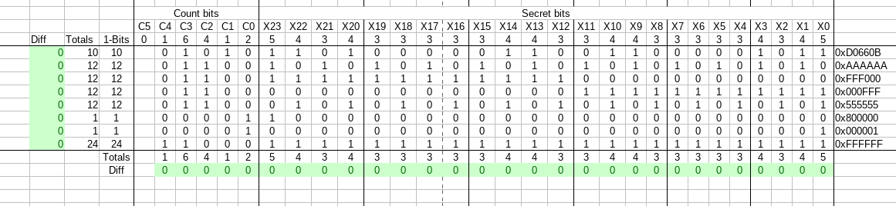

# Bit Extractor

Tests marked with `*` use configuration values different from the file in the repository.

* `Steps` denote actual MIMA steps as determined by the initial calibration run.
* `BitBranches` denote how many Steps * 11 are lost by a branch taken.

## Measurements

| Mask      | Steps-BitBranches | Score | File |
| --- | --- | --- | --- |
| 0x000000  | 803   | 1576  | bitExtract00_calib.mima |
| 0x000001  | 803-5 | 1631  | bitExtract01.mima\* |
| 0x000002  | 803-4 | 1620  | bitExtract01.mima\* |
| 0x000004  | 803-3 | 1609  | bitExtract01.mima\* |
| 0x000008  | 803-4 | 1620  | bitExtract01.mima\* |
| 0x000010  | 803-3 | 1609  | bitExtract01.mima\* |
| 0x000020  | 803-3 | 1609  | bitExtract01.mima\* |
| 0x000040  | 803-3 | 1609  | bitExtract01.mima\* |
| 0x000080  | 803-3 | 1609  | bitExtract01.mima\* |
| 0x000100  | 803-3 | 1609  | bitExtract01.mima\* |
| 0x000200  | 803-4 | 1620  | bitExtract01.mima\* |
| 0x000400  | 803-4 | 1620  | bitExtract01.mima\* |
| 0x000800  | 803-3 | 1609  | bitExtract01.mima\* |
| 0x001000  | 803-3 | 1609  | bitExtract01.mima\* |
| 0x002000  | 803-4 | 1620  | bitExtract01.mima\* |
| 0x004000  | 803-4 | 1620  | bitExtract01.mima\* |
| 0x008000  | 803-3 | 1609  | bitExtract01.mima\* |
| 0x010000  | 803-3 | 1609  | bitExtract01.mima\* |
| 0x020000  | 803-3 | 1609  | bitExtract01.mima\* |
| 0x040000  | 803-3 | 1609  | bitExtract01.mima\* |
| 0x080000  | 803-3 | 1609  | bitExtract01.mima\* |
| 0x100000  | 803-4 | 1620  | bitExtract01.mima\* |
| 0x200000  | 803-3 | 1609  | bitExtract01.mima\* |
| 0x400000  | 803-4 | 1620  | bitExtract01.mima\* |
| 0x800000  | 803-5 | 1631  | bitExtract01.mima\* |
| 0x000000  | 851   | 1192  | parityExtract00_callib.mima |
| 0x000001  | 851-2 | 1214  | parityExtract00_callib.mima\* |
| 0x000000  | 839   | 1288  | bitCountExtract_callib.mima |
| 0x000001  | 839-2 | 1310  | bitCountExtract_callib.mima\* |
| 0x000002  | 839-1 | 1299  | bitCountExtract_callib.mima\* |
| 0x000004  | 839-4 | 1332  | bitCountExtract_callib.mima\* |
| 0x000008  | 839-6 | 1354  | bitCountExtract_callib.mima\* |
| 0x000010  | 839-1 | 1299  | bitCountExtract_callib.mima\* |
| 0x000020  | 839-0 | 1288  | bitCountExtract_callib.mima\* |
| 0x000000  | 844   | 1248  | Theory1 |
| 0x000001  | 844-1 | 1259  | Theory1\* |
| 0x000001  | 844-4 | 1292  | Theory2\* |
| 0x000000  | 843   | 1256  | Theory3 |
| 0x000001  | 843-0 | 1256  | Theory3\*0xe |
| 0x000001  | 843-1 | 1267  | Theory3\*0xa |
| 0x000001  | 843-0 | 1256  | Theory3\*0xf\*0x0 |
| 0x000001  | 843-2 | 1278  | Theory3\*0xf\*0x1 |
| 0x000001  | 843-4 | 1300  | Theory3\*0xf\*0xc |
| 0x000000  | 843   | 1256  | T4 Test For Explicit Value (Base) |
| 0xcccccc  | 843   | 1256  | T4 Test For Explicit Value (1010...) |
| 0x555555  | 843-1 | 1267  | T4 Test For Explicit Value (0101...) |
| 0xffffff  | 843-1 | 1267  | T4 Test For Explicit Value (1111...) |
| ?         | 849   | 1208  | T5 Bin Search Callib |
| 0xfff000  | 849-1 | 1219  | T5 Bin Search |
| 0xfc0000  | 849-1 | 1219  | T5 Bin Search |
| 0x03f000  | 849-2 | 1230  | T5 Bin Search |
| 0xf00000  | 849-0 | 1219  | T5 Bin Search |
| 0xc00000  | 849-0 | 1219  | T5 Bin Search |
| 0x800000  | 849-0 | 1219  | T5 Bin Search |
| 0x300000  | 849-2 | 1230  | T5 Bin Search |
| 0x100000  | 843-0 | 1256  | T4 Test For Explicit Value (0x100000) |
| 0x200000  | 843-0 | 1256  | T4 Test For Explicit Value (0x200000) |
| ?         | 850   | 1200  | T6 Bin Search Callib |
| 0xfff000  | 850-1 | 1211  | T6 Bin Search |
| 0x000fff  | 850-1 | 1211  | T6 Bin Search |
| 0x00003f  | 850-1 | 1211  | T6 Bin Search |
| 0x000007  | 850-1 | 1211  | T6 Bin Search |
| 0x000001  | 843-1 | 1267  | T4 Test For Explicit Value (0x1) |
| 0x000002  | 843-0 | 1256  | T4 Test For Explicit Value (0x2) |
| 0xfc0000  | 850-1 | 1211  | T6 Bin Search |
| 0xe00000  | 850-1 | 1211  | T6 Bin Search |
| 0x100000  | 843-0 | 1256  | T4 Test For Explicit Value (0x100000) |
| 0x800000  | 843-1 | 1267  | T4 Test For Explicit Value (0x800000) |
| ?         | 848   | 1216  | T7 Callib |
| 0x800000  | 848-1 | 1227  | T7 (cnt: 10, test 0x800000) |
| 0x800000  | 848-2 | 1238  | T7 (cnt: 12, test 0x800000) |
| 0x802000  | 848-0 | 1216  | T7 (cnt: 12, test 0x002000) |
| 0x802000  | 848-2 | 1238  | T7 (cnt: 12, test 0x802000) |
| 0x802200  | 848-1 | 1227  | T7 (cnt: 12, test 0x000200) |
| 0x802200  | 848-1 | 1227  | T7 (cnt: 12, test 0x802200) |
| 0x000020  | 848-0 | 1216  | T7 (cnt: 10, test 0x000020) |
| 0x000002  | 848-1 | 1227  | T7 (cnt: 10, test 0x000002) |
| 0x000008  | 848-1 | 1227  | T7 (cnt: 10, test 0x000008) |
| 0x000001  | 848-1 | 1227  | T7 (cnt: 10, test 0x000001) |
| 0x000004  | 848-0 | 1216  | T7 (cnt: 10, test 0x000004) |
| 0x040000  | 848-0 | 1216  | T7 (cnt: 10, test 0x040000) |
| 0x842200  | 848-0 | 1216  | T7 (cnt: 12, test 0x842200) |
| 0x842200  | 848-1 | 1227  | T7 (cnt: 12, test 0x842000) |
| 0x842204  | 848-0 | 1216  | T7 (cnt: 12, test 0x802204) |
| 0x842204  | 848-0 | 1216  | T7 (cnt: 12, test 0x842004) |
| 0x842204  | 848-1 | 1227  | T7 (cnt: 12, test 0x000204) |
| 0x842205  | 848-0 | 1216  | T7 (cnt: 12, test 0x802201) |
| 0x842205  | 848-0 | 1216  | T7 (cnt: 12, test 0x842001) |
| 0x7bc000  | 848-0 | 1216  | T7 (cnt: 10, test 0x000000) Bin Search|
| 0x001df0  | 848-0 | 1216  | T7 (cnt: 10, test 0x000000) Bin Search|
| 0x0000f0  | 848-1 | 1227  | T7 (cnt: 10, test 0x000000) Bin Search|
| 0x000d00  | 848-0 | 1216  | T7 (cnt: 10, test 0x000000) Bin Search|
| 0x00d000  | 848-0 | 1216  | T7 (cnt: 10, test 0x000000) Bin Search|
| 0x0b0000  | 848-1 | 1227  | T7 (cnt: 10, test 0x000000) Bin Search|
| 0x700000  | 848-0 | 1216  | T7 (cnt: 10, test 0x000000) Bin Search|
| 0x005d00  | 848-0 | 1216  | T7 (cnt: 10, test 0x000000) Bin Search|
| 0x001c00  | 848-0 | 1216  | T7 (cnt: 10, test 0x000000) Bin Search|
| 0x001000  | 848-0 | 1216  | T7 (cnt: 10, test 0x001000) Bin Search|
| 0x000800  | 848-0 | 1216  | T7 (cnt: 10, test 0x000800) Bin Search|
| 0x000400  | 848-1 | 1227  | T7 (cnt: 10, test 0x000400) Bin Search|
| 0x000100  | 848-0 | 1216  | T7 (cnt: 10, test 0x000100) Bin Search|
| 0x100000  | 848-1 | 1227  | T7 (cnt: 10, test 0x100000) Bin Search|
| 0x600000  | 848-0 | 1216  | T7 (cnt: 10, test 0x000000) Bin Search|
| 0x200000  | 848-0 | 1216  | T7 (cnt: 10, test 0x200000) |
| 0x400000  | 848-1 | 1227  | T7 (cnt: 10, test 0x400000) |
| 0x008000  | 848-0 | 1216  | T7 (cnt: 10, test 0x008000) |
| 0x842207  | 848-0 | 1216  | T7 (cnt: 10, test 0x844002) |
| 0x84220f  | 848-0 | 1216  | T7 (cnt: 10, test 0x844008) |
| 0x842207  | 848-0 | 1216  | T7 (cnt: 10, test 0x842002) |
| 0x84220f  | 848-0 | 1216  | T7 (cnt: 10, test 0x842008) |
| 0x842207  | 848-0 | 1216  | T7 (cnt: 12, test 0x842002) |
| 0x84220f  | 848-0 | 1216  | T7 (cnt: 12, test 0x842008) |
| 0x00000f  | 848-1 | 1227  | T7 (cnt: 12, test 0x000000) |
| 0x84230f  | 848-0 | 1216  | T7 (cnt: 12, test 0x842100) |
| 0x0c0000  | 848-1 | 1227  | T7 (cnt: 12, test 0x0c0000) |
| 0x8c0000  | 848-1 | 1227  | T7 (cnt: 12, test 0x8c0000) |
| 0x860000  | 848-1 | 1227  | T7 (cnt: 12, test 0x860000) |
| 0x860000  | 848-1 | 1227  | T7 (cnt: 12, test 0x820000) |
| 0x8c0000  | 848-1 | 1227  | T7 (cnt: 12, test 0x880000) |
| 0xD0660B  | 843-1 | 1267  | T4 Test For Explicit Value (0xD0660B) |
| 0x8f0000  | 848-1 | 1227  | T7 (cnt: 12, test 0x8f0000) |
| 0x9f0000  | 848-1 | 1227  | T7 (cnt: 12, test 0x9f0000) |
| 0xbf0000  | 848-1 | 1227  | T7 (cnt: 12, test 0xbf0000) |
| 0xff000f  | 848-1 | 1227  | T7 (cnt: 12, test 0xff0000) |
| 0xff0000  | 848-0 | 1216  | T7 (cnt: 12, test 0x200000) |
| 0xff800f  | 848-1 | 1227  | T7 (cnt: 12, test 0xff8000) |
| 0xff900f  | 848-1 | 1227  | T7 (cnt: 12, test 0xff9000) |
| 0xffb00f  | 848-1 | 1227  | T7 (cnt: 12, test 0xffb000) |
| 0xFFF000  | 843-1 | 1267  | T4 Test For Explicit Value (0xFFF000) |
| 0xff800f  | 848-0 | 1216  | T7 (cnt: 12, test 0x00800f) |
| 0xAAAAAA  | 843-1 | 1267  | T4 Test For Explicit Value (0xAAAAAA) |
| 0x000fff  | 843-1 | 1267  | T4 Test For Explicit Value (0x000fff) |

## Deductions

| X | 23 | 22 | 21 | 20 | 19 | 18 | 17 | 16 | 15 | 14 | 13 | 12 | 11 | 10 |  9 |  8 |  7 |  6 |  5 |  4 |  3 |  2 |  1 |  0 |
| --- | --- | --- | --- | --- | --- | --- | --- | --- | --- | --- | --- | --- | --- | --- | --- | --- | --- | --- | --- | --- | --- | --- | --- | --- |
|1 Bits| 5  | 4  | 3  | 4  | 3  | 3  | 3  | 3  | 3  | 4  | 4  | 3  | 3  | 4  | 4  | 3  | 3  | 3  | 3  | 3  | 4  | 3  | 4  | 5 |

## Ref Sheet

## Found Values
* 0x555555
* 0xffffff
* 0x000001
* 0x800000
* 0xD0660B
* 0xFFF000
* 0xAAAAAA
* 0x000FFF
